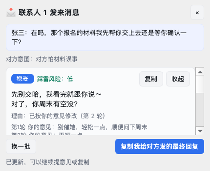
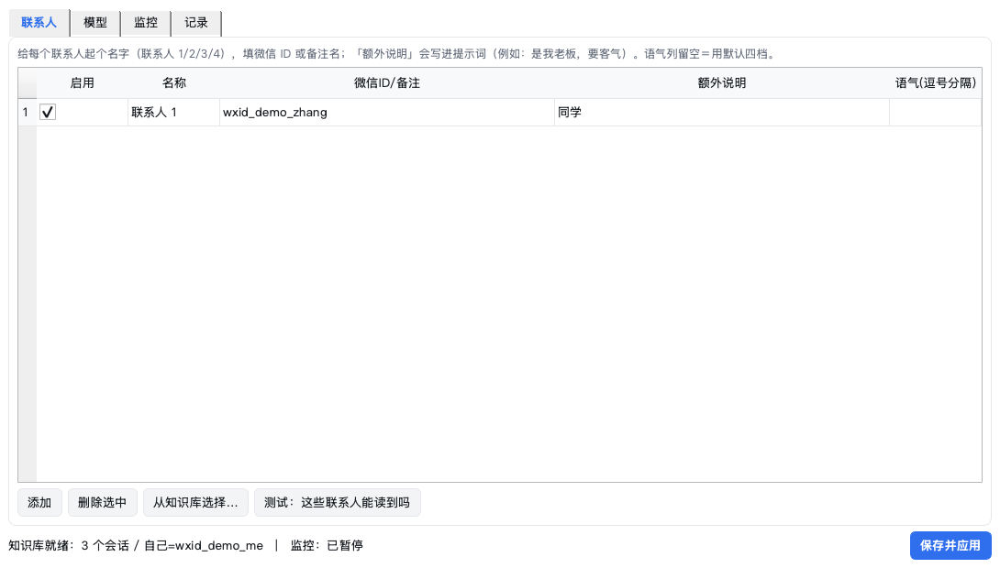

# 微信辅助回复助手（WxReply）

Windows 桌面小工具：**用你本地已解密的微信 4.x 聊天记录当知识库**，在指定联系人发来消息时自动弹窗，
给出几条语气/倾向不同的候选回复并说明理由；你可以直接复制，也可以对某条候选写意见（"太硬了软一点""顺便问下周末"），
反复改到满意再复制去微信里发送。

**它不替你发消息**：只生成文字、只写剪贴板，发送永远由你本人动手。

> **免责声明 / 使用边界**
> 本工具只读取**你自己**在本机已经解密好的聊天数据，用来给你自己起草回复；它**不注入微信、不修改任何微信数据库、
> 不自动发送消息**，只把候选文字写进剪贴板。数据全程留在本机，唯一的外部请求是你在「模型」页自己填的那个接口
> （不接模型时完全不出网）。请只在符合当地法律与微信服务条款的前提下使用，使用后果自负；作者不提供任何担保。




---

## 1. 它解决什么

- 发消息前反复纠结措辞、怕踩雷 → 直接给几条不同语气的成品句，附「为什么这样说」。
- 想模仿自己平时的说话习惯 → 提示词里带上你在该会话里历史消息的用词样例。
- 想改而不是重来 → 每条候选都能写意见，多轮改写，历史意见保留在卡片上。
- 不想被全自动代替 → 没有"自动发送"功能；剪贴板 + 你自己粘贴。

## 2. 运行环境

| 项 | 要求 |
| --- | --- |
| 系统 | Windows 10/11（macOS / Linux 也能跑，用于调试） |
| Python | 3.10+（源码运行方式需要；用打包好的 exe 则不需要） |
| 微信 | 4.x（4.4.x 实测），需要**已经解密的**数据库作为知识库 |
| 模型 | 任意 OpenAI 兼容接口（火山方舟 / OpenAI / DeepSeek / 本地 Ollama…）；也可先用离线模板模式 |

## 3. 快速开始（Windows）

**部署清单（从零到能用）**

1. 装 Python 3.10+（python.org 安装包记得勾 *Add python.exe to PATH*）；或直接用打包好的 exe 跳过 2–3 步。
2. 拿代码：`git clone <仓库地址>`（或下载 zip 解压）。
3. 建环境：`python -m venv .venv` → `.venv\Scripts\python.exe -m pip install -r requirements.txt`。
4. 准备数据（二选一，见下一节）：**已解密目录**，或 **keys.json + 微信数据目录**。
5. 自检：`.venv\Scripts\python.exe -m wxreply selftest`（会自建一份虚拟库，不碰你的真实数据）。
6. 启动：双击 `start_wxreply.bat`，或 `.venv\Scripts\python.exe -m wxreply`。
7. 在界面里填三处：**监控**（数据来源与目录）→ **联系人**（联系人 1/2/3/4）→ **模型**（Base URL / API Key / 模型 ID），
   然后点「保存并应用」。状态栏出现「知识库就绪：N 个会话」就成功了。
8. 要分发：`powershell -ExecutionPolicy Bypass -File tools\build_windows.ps1`，产物在 `dist\WxReply\`。

> 权限提示：读**已解密目录**不需要管理员权限。只有当你自己做「从微信进程内存取密钥」那一步时才需要，
> 那是你本地工具的事，本程序不参与。杀软可能对 PyInstaller 产物误报，加白即可；防火墙只在调用远程模型接口时用到。


### 方式 A：打包成 exe（推荐分发）

```powershell
powershell -ExecutionPolicy Bypass -File tools\build_windows.ps1
```

脚本会：建 `.venv` → 装依赖 → 跑测试 → 生成图标 → 自检 → PyInstaller 打包。
产物：`dist\WxReply\WxReply.exe`（整个 `dist\WxReply` 文件夹拷给别人即可用）。

### 方式 B：源码运行

```powershell
python -m venv .venv
.\.venv\Scripts\python.exe -m pip install -r requirements.txt
.\.venv\Scripts\python.exe -m wxreply           # 或双击 start_wxreply.bat
```

装完之后建议先自检一遍（会自建一份虚拟聊天库，不需要你的真实数据）：

```powershell
.\.venv\Scripts\python.exe -m wxreply selftest
# 顺便体检你的真实知识库：
.\.venv\Scripts\python.exe -m wxreply selftest --kb "D:\wechat_decrypted"
```

## 4. 准备微信数据（两种模式）

打开程序左侧 **监控** 页选择数据来源。

### 模式一 `dir`：直接读你已经解密好的目录（最省事）

目录结构要和微信 4.x 本地库一致（你的解密工具/脚本只要产出这种结构就行）：

```
<已解密目录>/
├── contact/contact.db        # contact 表（备注 remark、昵称 nick_name）
├── session/session.db        # SessionTable
└── message/message_0.db      # 每个会话一张 Msg_<md5(wxid)> 表，可分散在 message_*.db
```

填「已解密数据库目录」→ 保存并应用。知识库由你的工具负责刷新，程序每个轮询周期读一次新消息。

### 模式二 `decrypt`：程序自己增量解密

填三个路径：

- 微信数据目录：`C:\Users\<你>\Documents\xwechat_files`（或直接指向 `<wxid>_xxxx\db_storage`）
- keys.json：由你的密钥提取工具产出。两种格式都认：
  - `{"message/message_0.db": {"enc_key": "64位hex"}}`（wxkey-hook / wxecho 风格）
  - `{"message/message_0.db": "x'<64位hex key><32位hex salt>'"}`（wechat-msg-mcp 风格）
- 解密输出目录：随便一个空目录，程序往里镜像可读的 sqlite

程序只按**源文件 (mtime, size) 变化**触发重新解密，实测 73MB 的消息库约 0.1～0.3 秒，
所以轮询默认 3 秒也不会拖慢机器。`-wal` 会**尽力**一起解密（帧布局不符时自动忽略，绝不把脏页喂给 sqlite）。

> **实时性说明（实测口径）**：解密本身是秒级；消息什么时候能被读到取决于微信把数据落盘/checkpoint 的时机，
> 通常几秒到几分钟。想更快就把微信窗口切一下（会触发 checkpoint）。
> 实测 4.4.x 的 `-wal` 里常只剩未提交的预分配残页（`dbsize=0`），此时**主库就是权威来源**。

> **4.4.x 加密格式会变**：如果密钥/格式不匹配，程序会在状态栏报"解密后无法用 sqlite 打开"，
> 并且**不写出任何错误文件**。这种情况请用你已有的解密工具产出目录，改用 `dir` 模式。

## 5. 配置"联系人 1/2/3/4"

**联系人** 页每一行就是一个被监控对象：

| 列 | 说明 |
| --- | --- |
| 启用 | 勾上才监控 |
| 名称 | 显示用，例如 `联系人 1`、`老板`、`妈妈` |
| 微信ID/备注 | 填 wxid（`wxid_xxx`）、群 id（`xxx@chatroom`）、备注名或昵称都行，点「从知识库选择…」可以直接挑 |
| 额外说明 | 写进提示词的角色提示，例如"是我老板，注意分寸""同学，随便聊" |
| 语气(逗号分隔) | 留空用默认四档（稳妥 / 轻松 / 直球 / 简短）；也可写 `客气, 幽默, 直接` |

点 **测试：这些联系人能读到吗** 会显示每个联系人解析到的身份和最近一条消息时间，一眼看出有没有填错。

首次绑定某个联系人时程序**只记录进度、不倒放历史**（避免一开就被旧消息刷屏）；
之后只有新出现的消息才弹窗，且默认只提醒 15 分钟内的（`只提醒 N 分钟内的新消息`可改）。

## 6. 接入模型

**模型** 页：

| 提供方 | 说明 |
| --- | --- |
| `offline（离线模板，不联网）` | 不调用模型，给固定模板候选。用来先跑通流程 / 无网环境。界面会明确提示"离线模板模式"。 |
| `openai（OpenAI 兼容接口）` | 任何 `POST {base_url}/chat/completions` 的服务。 |

常用填法（Base URL / 模型 ID）：

| 服务 | Base URL | 模型 ID 示例 |
| --- | --- | --- |
| 火山方舟 | `https://ark.cn-beijing.volces.com/api/v3` | 你的接入点 `ep-xxxx` 或方舟模型 ID |
| OpenAI | `https://api.openai.com/v1` | `gpt-4o-mini` |
| DeepSeek | `https://api.deepseek.com/v1` | `deepseek-chat` |
| 本地 Ollama | `http://127.0.0.1:11434/v1` | `qwen2.5:7b` |

细节：

- 本地地址（`127.0.0.1` / `localhost`）**不要求** API Key。
- 若模型不接受 `temperature` 或 `max_tokens` 参数名，客户端会自动降级重试（去掉 temperature / 换成 `max_completion_tokens`）。
- **带思考过程的模型请把「最大输出 tokens」调大**（默认 2048；调到 3000～4000 更稳），否则思考吃光预算、正文可能为空。
- 点「测试连接」会真发一条极小的请求。

`最大输出 tokens`、`候选条数`、`历史上下文条数`、`模仿语气样例条数` 都在这一页调。

## 7. 日常使用

1. 托盘常驻。菜单：打开设置 / 立即检查一次 / 暂停监控 / 退出。
2. 某个被监控联系人发来消息 → 右下角弹窗（位置可换四个角）+ Windows 通知。
3. 卡片上：**复制**（写剪贴板）、**提意见改写**（输入框里写"太硬了/加一句约时间"，可连续多轮，历史保留）。
4. 底部 **换一批**：在已有候选之外再要几条不同角度。
5. 底部 **复制我给对方发的最终回复**：复制当前选中的那条改好后的文本。
6. **记录** 页保留最近 100 条事件（对方说了什么、给过哪些候选），方便回看。

数据都放在本机：`%APPDATA%\wxreply\config.json`（配置，含 API Key，注意别外发）和 `history.jsonl`（记录）。

## 8. 命令行

```powershell
python run.py                                     # 图形界面（等价 python -m wxreply）
python -m wxreply selftest [--kb DIR]              # 自检（依赖/知识库/生成/界面）
python -m wxreply check --kb DIR                   # 知识库统计 + 联系人解析结果
python -m wxreply once --kb DIR --chat 备注名 [--text "对方的话"] [--refine "意见"]
                                                   # 不开界面跑一次生成 / 验证多轮改写
python -m wxreply demo --kb DIR --chat 备注名      # 离线模板跑一次
python -m wxreply refresh --src <xwechat目录> --out <解密输出> [--keys keys.json] [--force] [--no-wal]
```

## 9. 目录结构

```
wxreply/
├── __main__.py        # CLI 入口（gui/selftest/check/once/demo/refresh）
├── config.py          # 配置（JSON 落盘）
├── engine.py          # 候选生成 / 换一批 / 多轮改写 / 记录
├── prompts.py         # 中文提示词模板
├── llm.py             # OpenAI 兼容客户端（含参数兼容降级、JSON 兜底解析）
├── watcher.py         # 轮询新消息 → 事件（可线程跑，也可单次跑）
├── kb/
│   ├── crypto.py      # SQLCipher4 解密 + 增量镜像 + WAL 尽力解密
│   ├── reader.py      # 读解密库：联系人 / 消息 / 方向 / 群发言人
│   ├── models.py      # Contact / Message
│   └── paths.py       # 微信目录与 keys.json 发现
└── ui/
    ├── app.py         # 装配：托盘 + 监控线程 + 生成线程 + 弹窗（队列回主线程）
    ├── main_window.py # 联系人 / 模型 / 监控 / 记录 四个页
    └── popup.py       # 弹窗 + 候选卡片
tools/make_demo_kb.py  # 生成虚拟演示知识库（测试与自检用，不含任何真实聊天）
tools/build_windows.ps1, wxreply.spec, start_wxreply.bat
tests/                 # 62 项测试，含离屏界面联调（真点按钮、真读剪贴板、真跑监控线程）
```

## 10. 技术事实（已用真实 4.4.x 库逐条验证，写下来免得再踩）

1. 会话表名 `Msg_<md5(username)>`；表分散在 `message_0..N.db`（`Name2Id` 可反查）。
2. **`real_sender_id` 是该消息库 `Name2Id` 表的 rowid**，不是 `contact.id`。
   自己的 rowid 用 `Name2Id.user_name == 自己的 wxid` 定位（账号目录名 `wxid_xxx_<hash>` 可推出自己的 wxid）。
   方向判断 `is_from_me = (real_sender_id == 自己的 rowid)`；群消息正文另有 `wxid_xxx:\n` 前缀区分发言人。
3. 库是 SQLCipher 4：页 4096，保留区 80 = IV(16)+HMAC(64)，AES-256-CBC，raw-key；
   页 1 = `salt(16) + enc(4000) + iv + hmac`，页 N = `enc(4016) + iv + hmac`，解密后保留区补 0；
   解密库页头第 21 字节为 80（reserve）。
4. `-wal` 的页布局与主库一致（页 1 同 `salt+enc(4000)` 形态），可直接套用同一解密函数；
   但实测微信常留下未提交残页（`dbsize=0`），别指望它一定带来更快的消息。

## 11. 已知边界（有意不做）

- **不自动发送、不操作微信窗口**：没有注入、没有 RPA、不点坐标。只做候选 + 剪贴板。
- 只理解**文本**消息；图片/语音/视频/文件只当占位（`[图片]` 等），不解析内容。
- 群消息按发言人（`wxid` 前缀）区分，不处理 @ 列表、不区分群昵称和备注。
- 不做历史消息检索问答（知识库只用于"最近上下文 + 语气样例"）。
- 不修改任何微信数据库：`dir` 模式只读；`decrypt` 模式只往你自己的输出目录写。

## 12. 常见问题

**弹窗不出现？**
① 监控页确认"开启实时监控"已勾选、状态栏显示"监控：运行中"。② 点「立即检查一次」看提示。
③ 用 `check --kb <目录>` 确认联系人能解析到、且最近消息时间在动。
④ 数据源不是"新"的：程序只提醒新出现的消息，默认还得在 15 分钟内。

**联系人解析不到？**
填备注名/昵称最稳（点「从知识库选择…」）。同名多人时会取最匹配的一个。

**只想安静一会儿？**
托盘 → 暂停监控；或在监控页取消"开启实时监控"。

**隐私？**
所有数据都在本机处理。唯一的外部请求是你在「模型」页配置的那个接口；聊天内容会作为上下文发给它
（所以要清楚自己用的是哪个模型服务）。不接模型（offline）时完全不出网。

## 13. 开发

```bash
python -m pytest -q                       # 62 项
python -m ruff check --select F,E9,B wxreply tools tests run.py
python -m wxreply selftest                # 打包产物里也可用（冻结后已验证）
python run.py selftest --kb <已解密目录>   # 顺便体检真实知识库
```

逐条需求 → 证据的对照表见 `docs/evidence/verification.md`。

测试覆盖：解密往返（含真实 SQLite 写出的 WAL 重放）、仅 `dir`/`decrypt` 两种数据源、
方向与群发言人识别、监控游标与去重、JSON 容错与多轮改写、参数兼容降级、
以及**离屏界面联调**（真点"复制/提意见/换一批/最终复制"，断言剪贴板内容与改写历史）。
